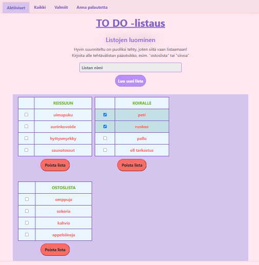
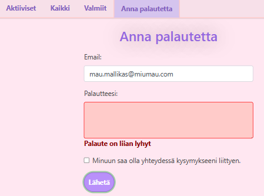

<h1> To do -lista 1.1 </h1>
Web kehitys 1 (FRONT END)- kurssin ensimmäisen projektin työstöä  

- Luodaan yksinkertainen to do -lista  
- Hyödynnetään DOM-skriptausta  
- Julkaistaan Netlify-palvelussa  

## Projektin nimi ja tekijät
Projekti 1.1. To do-lista DOM-skriptauksella  
Taru Laine

## Verkkolinkit:
Pääset julkaistuun sovellukseen käsiksi osoitteessa: https://todolinea.netlify.app/  
Projektin videoesittelyn url toimitettu palautuksen kommenttikentässä.

## Oma arvio työstä ja oman osaamisen kehittymisestä
Mielestäni onnistuin kaiken kaikkiaan projektissa hyvin.  
Vaatimusten mukaan käytin vain "natiivi" JavaScriptiä ja sovellus sisältää DOM-skriptausta  
sekä lomakketta ja muita syöttökenttiä. Myös muut vaatimukset täyttyvät.  
Lisäksi sovellus sisältää ylimääräisiä elementtejä eli sovellusta on työstetty enemmän,  
kuin mitä vaatimuksissa pyydetään. Responsiivisuus toimii jo melko hyvin.

Parantamisen varaa olisi listan luonnin jälkeen tehtävien lisäysosion sijoittelussa.  
Tämä korjaustarve johtuu siitä, että loin alkuun kaikki tiedostot alusta alkaen itse,  
tarkoittaen html-, css- ja javascript- tiedostoja [Projetki1](https://github.com/tLineaaa/Web_kehitys1_Projects/tree/737ad40c7cfc9dc8f685c5f1d6917574c9076af1/Projekti1)  
ja hyödynsin Bootstrapiä vasta tämän jälkeen tässä versiossa projektista.  
Yhdistin siis itseluomaani Bootstrapiin enkä tahtonut tuhota jo tehtyä työtä.  

Jos aloittaisin projektin alusta, korjaisin tehtävälistojen lisäyskohdat käyttämällä toisenlaista lomaketta  
enkä näin ollen muodostostaisi taulukkokortteja itse. Ideaaliratkaisu olisi sellainen, jossa ns. pääotsikko näkyisi  
ja sen alle voisi kirjoittaa lisäykset suoraan. Tällainen vaihtoehto todennäköisesti löytyy Bootstrapista.  

Jos lisäisin vielä asioita, lisäisin muokkauspainikkeen jokaisen listan alle,  
laittaisin Valmiit-sivun (removed.html) painikkeet toimimaan ja lisäisin alasvetovalikon,  
josta voi valita tietyn listan näkyville. Lisäksi muokkaisin värejä ja muotoiluja.  

Opin funktioiden luontia JavaScripitillä, osaan lisätä kuuntelijoita elementteihin ja osaan piilotaa sekä palautta elementtejä.  
Erityisesti tykkäsin oppia, miten tarkistetaan jokin asia niin, että se toimii vain tietyllä html:llä.  

Hieman epäselvää on vielä Local Storagen käyttöönotto. Nyt sain sen toimimaan ChatGPT:n avustuksella.  
Voi olla, että tarvitsee muutamat kerrat itse tehdä, jotta alkaa sujumaan kunnolla.  

Antaisin itselleni pisteitä: xx/yy p.

## Palaute opettajalle kurssista sekä itse opetuksesta tähän saakka
Kurssi on ollut mielenkiintoinen ja tämä projekti oli mielestäni sopiva osaamistasoon nähden.  
Oppimistani tukisi parityöskentely, johon meille on annettukin mahdollisuus.

## Sisällysluettelo:
- [Tietoja sovelluksesta](#tietoja-sovelluksesta)
- [Tunnetut virheet/bugit](#Tunnetut-virheet/bugit)
- [Kuvakaappaukset](#kuvakaappaukset)
- [Teknologiat](#teknologiat)
- [Asennus](#asennus)
- [Lähestymistapa](#lähestymistapa)
- [Kiitokset](#kiitokset)
- [Lisenssi](#lisenssi)

## Tietoja sovelluksesta
Projekti 1.1 To Do -lista DOM-skriptauksella on sovellus, johon voit kirjata muistettavia asioita kuten  
ostoslista, siivouslista tai vaikka pakattavat reissutarvikkeet.  

Voit merkitä tehdyt kohdat checkboxin avulla sekä voit poistaa listoja. 

Halutessasi voit tarkastella ainoastaan aktiivisia listojasi tai tehtyjä listojasi tai kaikkia listoja samaan aikaan.  
Lisäksi voit lähettää palautetta, esim. sovelluksen toimivuudesta.  

## Tunnetut virheet/bugit
Painikkeiden "otantapinta" on välillä turhan pieni tai sitten klikkaustapahtuman kuuntelu jollain tapaa hidastaa toimintaa,  
sillä "lisää"-painike ei tunnu aina toimivan.

## Kuvakaappaukset

Etusivun malli, listojen lisäys ja poisto, checkboxit  
  

Palautelomake tarkistaa lähettäessä ja herjaa tarvittaessa  
  

Kuvat: Taru Laine  

## Teknologiat
Pohjan luonnissa käytin html:ää ja hyödynsin sen yhteydessä Bootstrapiä.  
Muotoiluun käytin pääasiassa css:ää. Osa muotoilusta on JavaScriptin puolella (e.style.background tms.).  
Pääpaino on kuitenkin JavaScriptissä, joka hoitaa painikkeiden ja kenttien tarkistusta sekä kuuntelua.  

## Asennus
Sovellus toimii suoraan Netlifyssä: [To Do -app / Linea](https://todolinea.netlify.app/)  
Klikkaa yllä olevaa linkkiä, jonka jälkeen voit alkaa luomaan listoja.  

Kirjoita listan pääotsikko kohtaan "Listan nimi" ja klikkaa "Luo uusi lista"-painiketta.  
Nyt voit tarkentaa listaa kirjaamalla tehtäviä "Lisää tehtävä listaan"-osioon ja klikkaamalla "Lisää"-painiketta.  
HUOM! Myös Enter-näppäintä voi hyödyntää painikkeiden sijaan.  

Listat tulevat syöttökenttien alle näkyviin.  

Sinulla on mahdollisuus poistaa luotu lista sekä merkitä tehtäväosioita tehdyiksi.  
Voit myös lähettää palautetta sovelluksesta ja seurata erikseen aktiivisia listoja tai tehtyjä listoja.  

## Kiitokset

Hyödynsin projektin teossa Laurean Web-kehitys 1 (front end)-kurssin kurssimateriaalia  
sekä omaa aiempaa [websivusto-projektiani](https://github.com/tLineaaa/Websovellukset/tree/main/WS07_oma_sivu)  

Käytin ChatGPT:tä debuggauksessa, esim. bongatakseni kirjoitusvirheet,  
jotka rikkoivat koodin toimintaa sekä Local Storagen toimintaan saattamisessa.  
Kommenteissa on mainittu muutamat muut kohdat, joissa chatGPT on auttanut löytämään oikean kohdan tai neuvonut, kuinka, esim. Bootstrapin muotoilu ohitetaan.  

Hyödynsin myös vinkkejä ja keskusteluja sivustoilta:  
[GitHub Docs](https://docs.github.com/en)  
[Bootstrap](https://getbootstrap.com/)  
[Stack Overflow questions](https://stackoverflow.com/questions)  
[W3schools](https://www.w3schools.com/)  
[MDN](https://developer.mozilla.org/en-US/)  

## Lisenssi
MIT-lisenssi @ [Taru Laine](https://github.com/tLineaaa)