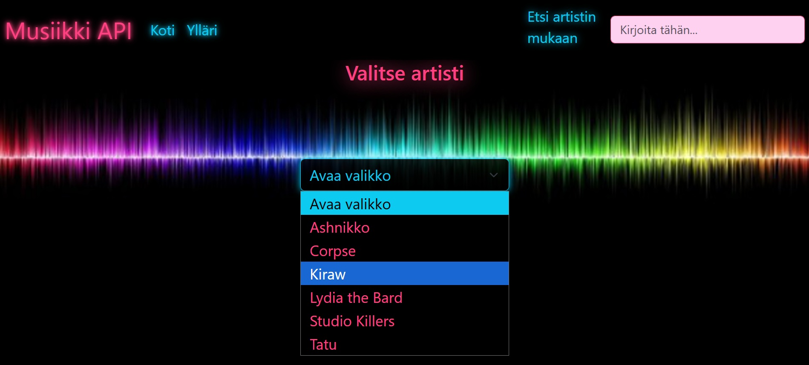
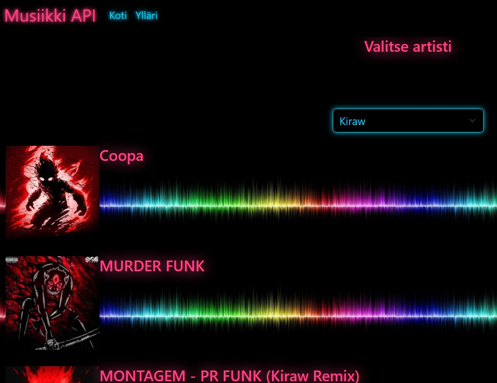
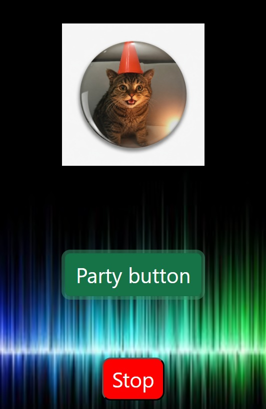

<h1> API-projekti </h1>
Web kehitys 1 (FRONT END)- kurssin toisen projektin työstöä  

## Projektin nimi ja tekijät
Projekti 2 Musiikki (ja kissa) API  
Taru Laine  

## Verkkolinkit:
Pääset julkaistuun sovellukseen käsiksi osoitteessa: [Musiikki API](https://tlineaaa.github.io/Web_kehitys1_Projects/Projekti2/)  
Projektin videoesittelyn url toimitettu palautuksen kommenttikentässä.  

## Oma arvio työstä ja oman osaamisen kehittymisestä
Projektini täyttää tehtävänannon vaatimukset:  
Suoritan datakutsun valitusta APIsta, itseasiassa kahdesta eri.  
Hyödynsin fetchiä ja tulostin haetun tiedon perusteella osiossa 1.  
artistin albumien nimet ja albumien kuvat näkymään siististi jokainen omana osionaan,  
ja osiossa 2. napin painalluksella kissakuvia joraamaan.  
  
Index.html:n UI sisältää sekä alasvetovalikon että hakukentän, joilla etsiä  
artisteja. Kun tehdään uusi haku, edelliset tiedot poistuvat näytöltä.  
  
Bonuksena tein "Ylläri"-sivun, jossa nappia klikkaamalla  
haetaan AJAX-kutsulla kissojen kuvia ja tuodaan ne näkyviin  
ruudulle.  
  
Jatkotyöstönä lisäisin mahdollisuuden albumien nimiä klikatessa  
saada näkyviin kyseessä olevan albumin kappaleiden nimet.  
Harkitsisin myös albumeiden asettamista ruudukkonäkymään listamaisen tyylin sijaan, ja    muuttaisin hampurilaisvalikon ulkoasua.  
Bonusosioon voisi lisätä mahdollisuuden valita kissavieraiden määrän sekä rodun tai rodut.  
API-avaimet siirtäisin myös piiloon.  
  
Opin erityisesti API:n hyödyntämisestä; miten fetch kutsu tehdään, kuinka  
vastausta käsitellään ja kuinka hyödyntää haettua dataa omalla sivullaan.  
Lisäksi opin hakupalkin luonnista/toiminnasta myös tässä hyödyntäen APIa.  
Funktioiden luonti alkoi jo käydä luontevammaksi tämän projektin myötä.  
  
Bonuksensa opin CSS:n hyödyntämisestä "animaatioiden" luonnissa sekä äänitiedoston käytöstä.  
  
Antaisin itselleni pisteitä 10/10 p.  

## Palaute opettajalle kurssista sekä itse opetuksesta tähän saakka
Kiitos, että annat aina tilaa kysymyksille ja keskustelulle.  
Tämä projekti tuntui alkuun haastavalta ja aiheen parissa voisin  
varmasti vielä jatkaa työskentelyä, jotta alkaa sujumaan sutjakkaammin.  

## Sisällysluettelo:
- [Tietoja sovelluksesta](#tietoja-sovelluksesta)
- [Tunnetut virheet/bugit](#tunnetut-virheet/bugit)
- [Kuvakaappaukset](#kuvakaappaukset)
- [Teknologiat](#teknologiat)
- [Asennus](#asennus)
- [Lähestymistapa](#lähestymistapa)
- [Kiitokset](#kiitokset)
- [Lisenssi](#lisenssi)

## Tietoja sovelluksesta
Sovellus on Musiikki API, jossa voit etsiä joko alasvetovalikosta
tai hakukentään kirjoittaen haluamaasi artistia. Sivulle tulostuu
näkymä haetun artistin albumeista kuvan ja tekstin kera.

Ylläri-osiossa voit klikata nappia ja aloittaa juhlat.
Myös tässä on hyödynnetty APIa, joskin kissa-apia.

## Tunnetut virheet/bugit
API-avaimet ovat nyt kaikille näkyvillä, joten siitä GitHub voi herjata.
Avaimet voi piilottaa ja sen tekisin seuraavan vastaavan projektin kohdalla.

## Kuvakaappaukset

# Etusivun malli: Valitse artisti alasvetovalikosta tai etsi hakukenttään kirjoittaen  
  

# Valittu artisti Kiraw + albumien tiedot kuvien kanssa 
  

# Kissa API -puolen iloinen kissa  
  

Kuvat: Taru Laine  

## Teknologiat
Projektissa on hyödynnetty niin HTMLää, CSSää kuin JavaScriptiä.
Html:n navikointi- ja hakupalkin muotoilussa on hyödynnetty Bootstrapia.
Muutoin muotoilu on luotu tyylit.css -tiedostoon.
Tapahtumat on luotu DOM-skriptauksella toimintaa.js -tiedostoon.

Pääpaino on JavaScriptin puolella, jossa suoritetaan AJAX-kutsu (fetch-kutsu) kahteen
eri API-osoitteeseen. Tämän jälkeen luodaan halutuille tiedoille paikat ja
näytetään tuodut tiedot.

## Asennus
Sovellus toimii suoraan github.io:ssa [Musiikki API](https://tlineaaa.github.io/Web_kehitys1_Projects/Projekti2/index.html)  

Linkin avattua etusivulla on alasvetovalikko, jossa lukee "Avaa valikko".  
Sitä klikkaamalla voi valikoida listalta artistin, jonka jälkeen valitun artistin  
albumit tulevat näkyviin nimien sekä albumikuvien kera.  
     
Oikeassa yläkulmassa on hakukenttä, jonka vieresssä lukee "Etsi artistin mukaan".  
Kun kohtaan "Kirjoita tähän..." alkaa kirjoittamaan haluamansa artistin tai bändin nimeä,   
näkyy hakukentän alapuolella ehdotustulos ja ruudulla alkaa näkyä kirjoitetun artistin  albumeja.  
  
Bonuksensa voit klikata vasemman ylävalikon "Ylläri"-painiketta.  
Nyt ruudulla näkyy "Ei saatavilla"-kuvasta tuttu surullinen kissa,  
jonka alapuolella on "Party button". Jos klikkaat painiketta,  
alkaa musiikki soida, surullinen kissa muuttuu iloiseksi ja  
sen kaverit ilmestyvät tanssimaan.  
Kun on aika lopettaa bileet, klikkaa "Stop"-painiketta  

## Kiitokset
  
Hyödynsin projektin teossa Laurean Web-kehitys 1 (front end)-kurssin kurssimateriaalia  
sekä omaa aiempaa [websivusto-projektiani](https://github.com/tLineaaa/Websovellukset/tree/main/WS07_oma_sivu)  

Kiitos kurssitoveri Iinalle, jonka kanssa pohdittiin API:n toimintaa.  

Käytin ChatGPT:tä debuggauksessa, ideoiden toiminnan varmistamisessa,  
animaatioiden aikaansaannissa sekä kissakuvan muokkauksesa. 
 

Hyödynsin myös vinkkejä ja keskustelujen kommentteja sivustoilta:  
[Bootstrap](https://getbootstrap.com/)  
[GitHub Docs](https://docs.github.com/en)  
[Last.fm Music Discovery API](https://www.last.fm/api)  
[Lazaris, L. 2023 Fetch API Tutorial for Beginners: How to Use Fetch API](https://wpshout.com/fetch-api-tutorial-for-beginners/)  
[MDN](https://developer.mozilla.org/en-US/)  
[Stack Overflow questions](https://stackoverflow.com/questions)  

Musiikki: [Brazilian Phonk by The_Mountain](https://pixabay.com/music/edm-brazilian-phonk-505181/)

## Lisenssi
[MIT-lisenssi](../LICENSE) @ [Taru Laine](https://github.com/tLineaaa)  

Loppukevennyksenä ChatGPTn kommentointia koodistani:  
"Selain katsoo sitä vähän kuin yrittäisit asentaa renkaat kahvikuppiin." 

"JavaScript on joskus kuin innokas siivooja: jos annat sille väärän huoneen avaimet, se tyhjentää koko talon."  

"Nyt koodisi pitäisi taas herätä henkiin ilman dramatiikkaa. JavaScript rakastaa tällaisia kirjoitusvirheitä – ne ovat sen lempivälipalaa."