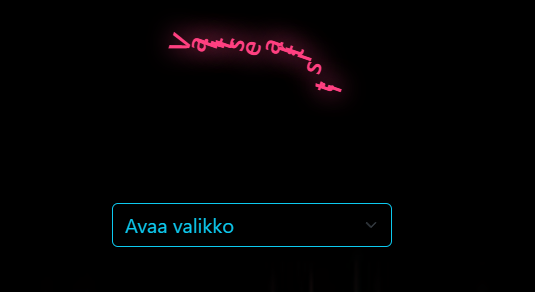
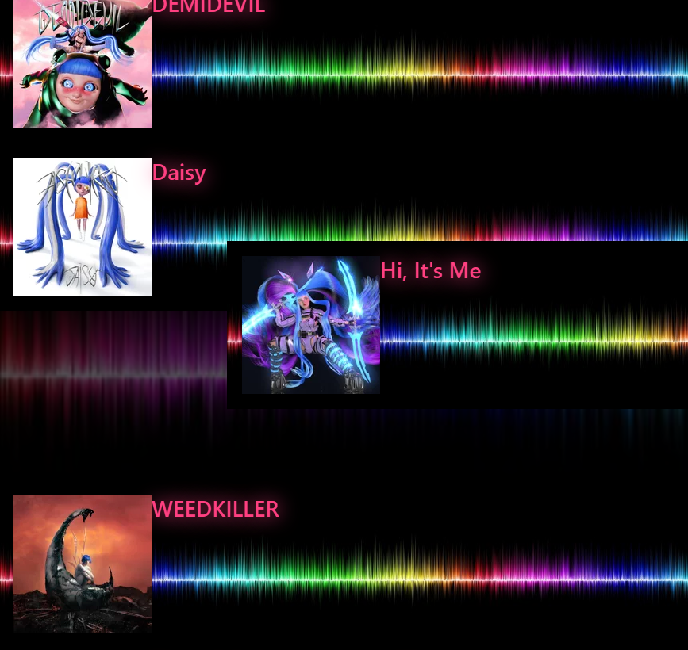
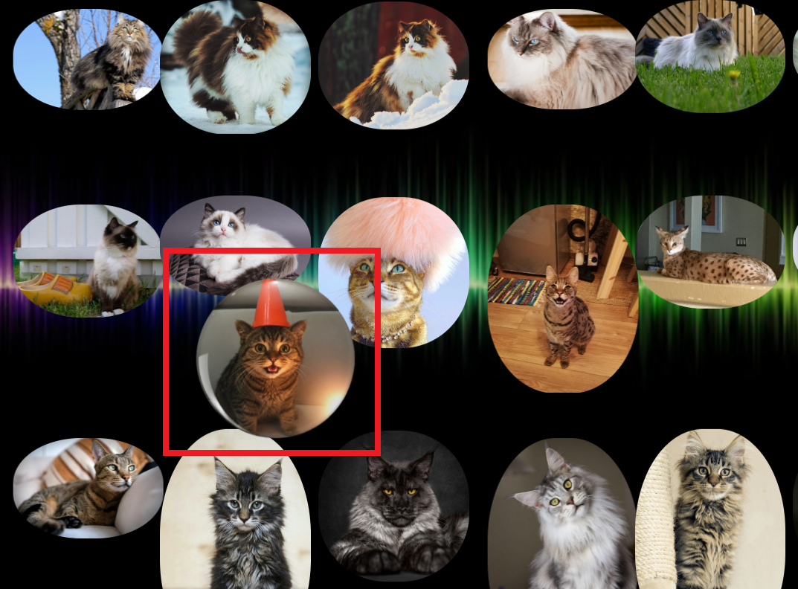

<h1> JS-sovellus ulkoisia kirjastoja käyttäen </h1>  
Web kehitys 1 (FRONT END)- kurssin kolmannen projektin työstöä  

## Projektin nimi ja tekijät
Projekti 3 Musiikki (ja kissa) API JS-kirjastoja hyödyntäen  
Taru Laine  

## Verkkolinkit:
Pääset julkaistuun sovellukseen käsiksi osoitteessa: [Musiikki API](https://tlineaaa.github.io/Web_kehitys1_Projects/Projekti3/)  
Projektin videoesittelyn url toimitettu palautuksen kommenttikentässä.  

## Oma arvio työstä ja oman osaamisen kehittymisestä
Projektini täyttää tehtävänannon vaatimukset:  
jQueryä on käytetty DOM-skriptauksen tekemiseen.  
Sovelluksen ulkoasussa on käytetty UI-kirjastoa (Bootstrap, jQuery UI + kevyet granim.js & anime.js)
Koodi on julkaistu GitHubissa ja sovellus GitHubin kautta.
Videodemo sekä projektiraportit on laadittu.

Opin alkeet siitä, kuinka JavaScript-kirjastoja voidaan hyödyntää.  
Hyödynsin näitä oppeja lisämäällä animoinnin sekä taustakuvaan,  
että "Valitse artisti" -otsikkoon (h3).  
Ekstrana lisäsin myös tausta-animaation pysäytyspanikkeen (käytettävyys huomioiden).  

jQuery UI:ta käytin, jotta albumeita voi liikuttaa / järjestää.  
Samaa metodia on käytetty myös ullatus.html:n juhlaKissa-kuvan kanssa.

Harjoittelin ja opin myös jQueryn käyttöä, jota hyödynsin projektissa  
lyhentääkseni koodia.  
Sanoisin, että myös debuggaus taitoni alkavat kehittymään.  
Jonkin toimimattomuuden ymmärrys ja korjaus alkaa olla helpompaa kuin aiemmin.  
  
Antaisin itselleni pisteitä 10/10 p.  

## Palaute opettajalle kurssista sekä itse opetuksesta tähän saakka
Kiitos vapaudesta luovuuden suhteen! Tämä mahdollistaa erilaisten projektien testailun mielenkiinnon kohteiden mukaan,  
ja avaa ovia oppia ylimääräistä (koska innostuminen ja uteliaisuus ohjaavat projektin kanssa eteenpäin).  
Kannustat opiskelijoita myös tilanteissa, joissa he kokeilevat kurssin ydinrakenteen ulkopuolisia teemoja!  

## Sisällysluettelo:
- [Tietoja sovelluksesta](#tietoja-sovelluksesta)
- [Tunnetut virheet/bugit](#tunnetut-virheet-tai-bugit)
- [Kuvakaappaukset](#kuvakaappaukset)
- [Teknologiat](#teknologiat)
- [Asennus](#asennus)
- [Lähestymistapa](#lähestymistapa)
- [Kiitokset](#kiitokset)
- [Lisenssi](#lisenssi)

## Tietoja sovelluksesta
Sovellus on Musiikki API, jossa voit etsiä joko alasvetovalikosta  
tai hakukentään kirjoittaen haluamaasi artistia. Sivulle tulostuu  
näkymä haetun artistin albumeista kuvan ja tekstin kera.  

Voit järjestää hakemasi albumit haluamaasi järjestykseen.  
Taustalla pyörii animoitu taustakuva, jonka voi "Pysäytä tausta"-painikkeen  
avulla pysäyttää.  

Ylläri-osiossa voit klikata nappia, joka aloittaa juhlat.  
Myös tässä on hyödynnetty APIa, joskin kissa-apia.  
JuhlaKissaa voi liikuttaa raahaamalla ja juhlat voi pysäyttää "Stop"-painiketta klikkaamalla.  

## Tunnetut virheet tai bugit
API-avaimet ovat nyt näkyvillä, joten siitä GitHub voi herjata.  
Pienemmällä ruudulla hampurilaisvalikko on melko pieni, samoin surullinenKissa ja juhlaKissa kutistuu kovasti.  
Taustan pysäytyspainike piiloutuu hampurilaisvalikon taakse (käytettävyyden kannalta tulisi olla näkyvissä kaiken aikaa).  
Alasvetovalikkoon jää artistin nimi jumiin, vaikka haettaisiin eri artisti hakuvalikkoon kirjoittamalla.  

## Kuvakaappaukset

**Etusivu: sivulle saapuessa otsikko "Valitse artisti" on animoitu**  
  

**Albumeita voi liikuttaa ja järjestää uudelleen** 
  

**Juhlakissaa voi liikuttaa kavereiden joukkoon**  
  

Kuvat: Taru Laine  

## Teknologiat
Projektissa on käytetty HTMLää, CSSää ja JavaScriptiä.
Aiempaan versioon (Projekti2) verrattuna, on nyt lisätty JavaScript-kirjastojen hyödyntämistä:  
jQuery, jQuery UI, granim.js ja animejs.

jQuerya on käytetty osassa DOM-skriptausta.
jQuery UI mahdollistaa albumien ja juhlakissan raahaus- ja uudelleenjärjestämistoiminnot.
granim.js animoi taustakuvan ja animejs animoi etusivun "Valitse artisti"-otsikon.
Bootstrapia on hyödynnetty navikointi- ja hakupalkeissa.

## Asennus
Sovellus toimii suoraan github.io:ssa [Musiikki API](https://tlineaaa.github.io/Web_kehitys1_Projects/Projekti3/index.html)  

Linkin avattua etusivulla on alasvetovalikko, jossa lukee "Avaa valikko".  
Sitä klikkaamalla voi valikoida listalta artistin, jonka jälkeen valitun artistin  
albumit tulevat näkyviin nimien sekä albumikuvien kera.  
Klikkaamalla ja raahamalla albumia, voit järjestää albumit uudelleen.  
     
Oikeassa yläkulmassa on hakukenttä, jonka vieresssä lukee "Etsi artistin mukaan".  
Kun kohtaan "Kirjoita tähän..." alkaa kirjoittamaan haluamansa artistin tai bändin nimeä,   
näkyy hakukentän alapuolella ehdotustulos ja ruudulla alkaa näkyä kirjoitetun artistin  albumeja.  
  
Bonuksensa voit klikata vasemman ylävalikon "Ylläri"-painiketta.  
Nyt ruudulla näkyy "Ei saatavilla"-kuvasta tuttu surullinen kissa,  
jonka alapuolella on "Party button". Jos klikkaat painiketta,  
alkaa musiikki soida, surullinen kissa muuttuu iloiseksi ja  
sen kaverit ilmestyvät tanssimaan.  
Voit siirtää iloiseksi muuttunutta kissaa raahamalla sitä ruudulla hiiren avulla.  
Kun on aika lopettaa bileet, klikkaa "Stop"-painiketta.  

## Kiitokset
  
Hyödynsin projektin teossa Laurean Web-kehitys 1 (front end)-kurssin kurssimateriaalia  
sekä omaa aiempaa [API-projektiani](https://github.com/tLineaaa/Web_kehitys1_Projects/tree/f336b3953503515c4ca79e88e48c04e4bbad5526/Projekti2)  

Käytin ChatGPT:tä debuggauksessa.  
 

Hyödynsin myös vinkkejä ja keskustelujen kommentteja sivustoilta:
[Acharya, D. P. 2025. The Best JavaScript Libraries and Frameworks. Kinsta](https://kinsta.com/blog/javascript-libraries/#the-most-popular-javascript-libraries)  
[Animejs](https://animejs.com/documentation/getting-started/) 
[BigBinary Academy](https://courses.bigbinaryacademy.com/)
[Bootstrap](https://getbootstrap.com/)  
[Granim.js](https://sarcadass.github.io/granim.js/)  
[jQuery](https://jqueryui.com/draggable/#sortable)  
[Mimo](https://mimo.org/glossary/css/rounding-an-image)  
[Stack Overflow](https://stackoverflow.com/questions)  

Musiikki: [Brazilian Phonk by The_Mountain](https://pixabay.com/music/edm-brazilian-phonk-505181/)

## Lisenssi
[MIT-lisenssi](../LICENSE) @ [Taru Laine](https://github.com/tLineaaa)  